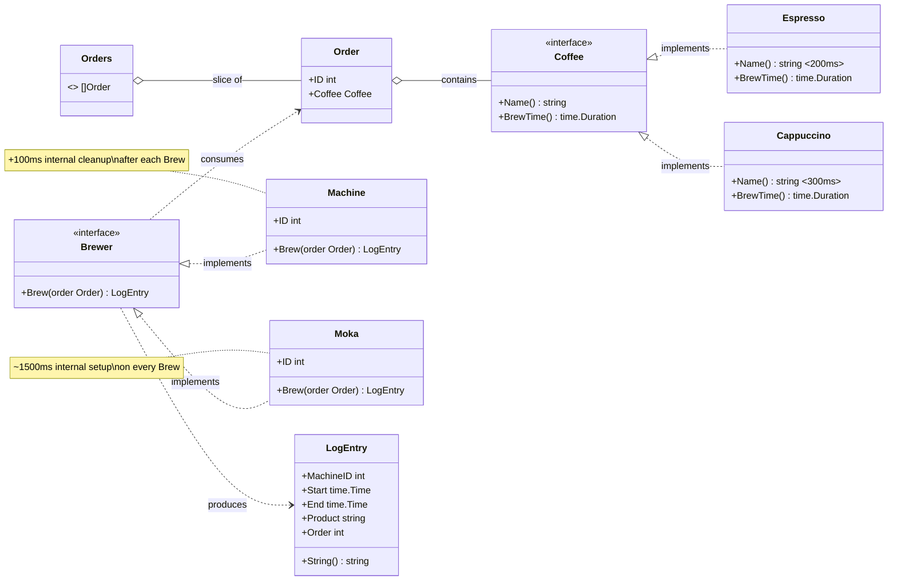

# Package `bar` — Architecture

A small library that simulates a coffee bar: you create coffee **orders** and have them
brewed by a **Brewer** (a coffee machine or a moka pot). Every brew produces a
printable **LogEntry**.

You don't need to know the internals: the constructors and the `Brew` call are all it takes.

## Mermaid diagram



## ASCII diagram

```text
                            PACKAGE bar
 ═══════════════════════════════════════════════════════════════════

   WHAT YOU ORDER                          WHO BREWS
   ──────────────                          ─────────

  ┌──────────────────────┐               ┌──────────────────────────┐
  │  <<interface>>       │               │  <<interface>>           │
  │  Coffee              │               │  Brewer                  │
  │──────────────────────│               │──────────────────────────│
  │ + Name() string      │               │ + Brew(Order) LogEntry   │
  │ + BrewTime() Duration│               └──────────────────────────┘
  └──────────┬───────────┘                       ▲            ▲
             │ implements                        │ implements │
      ┌──────┴────────┐                  ┌───────┴────┐  ┌────┴─────────┐
      ▼               ▼                  │  Machine   │  │  Moka        │
 ┌──────────┐  ┌────────────┐            │────────────│  │──────────────│
 │ Espresso │  │ Cappuccino │            │ + ID int   │  │ + ID int     │
 │  ~200ms  │  │   ~300ms   │            │            │  │              │
 └──────────┘  └────────────┘            │ (+100ms    │  │ (~1500ms     │
  NewEspresso() NewCappuccino()          │  cleanup   │  │  setup on    │
                                         │  after     │  │  every       │
                                         │  each Brew)│  │  Brew!)      │
                                         └────────────┘  └──────────────┘
       │                                  NewMachine(id)   NewMoka(id)
       │ contained in
       ▼
  ┌──────────────────┐
  │  Order           │      Orders = []Order
  │──────────────────│
  │ + ID     int     │
  │ + Coffee Coffee  │
  └──────────────────┘
   NewOrder(id, coffee)


   THE FLOW
   ────────

     Order ──────▶ brewer.Brew(order) ──────▶ LogEntry
                   (blocking: takes               │
                    BrewTime + overhead)          ▼
                                        ┌─────────────────────┐
                                        │  LogEntry           │
                                        │─────────────────────│
                                        │ + MachineID int     │
                                        │ + Start  time.Time  │
                                        │ + End    time.Time  │
                                        │ + Product string    │
                                        │ + Order   int       │
                                        │ + String() string   │ ◀── printable
                                        └─────────────────────┘     with fmt.Println
```

## API at a glance

| Constructor | Returns | Notes |
|---|---|---|
| `bar.NewEspresso()` | `Espresso` (a `Coffee`) | brews in ~200ms |
| `bar.NewCappuccino()` | `Cappuccino` (a `Coffee`) | brews in ~300ms |
| `bar.NewOrder(id, coffee)` | `Order` | |
| `bar.NewMachine(id)` | `Machine` (a `Brewer`) | fast, auto-cleans after every brew |
| `bar.NewMoka(id)` | `Moka` (a `Brewer`) | slow: ~1.5s setup on **every** `Brew` |

## Minimal example

```go
machine := bar.NewMachine(1)
order := bar.NewOrder(1, bar.NewEspresso())

entry := machine.Brew(order) // blocking!
fmt.Println(entry)
```

> The only call that matters: `brewer.Brew(order)` — **it blocks**.
> Serving 50 orders with a single machine, one at a time, keeps customers waiting. ☕
> Making it concurrent is up to you.
